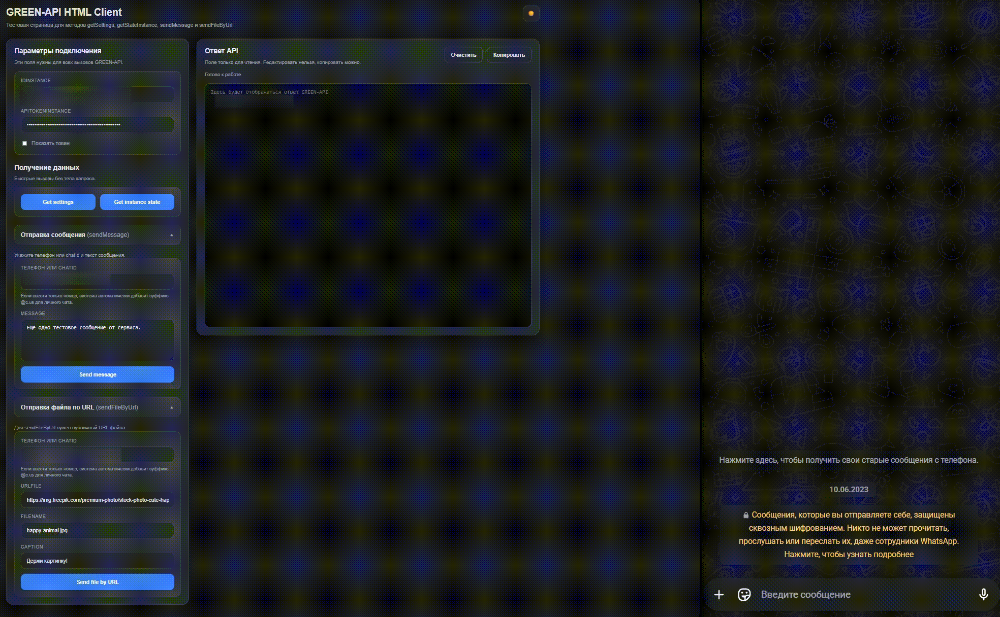

<div align="center">
  <h1 align="center">GREEN-API HTML Client</h1>
</div>

| Дата         | Версия  | Порт   | Имя сервиса             |
| ------------ | ------- | ------ | ----------------------- |
| `08.04.2026` | `1.0.0` | `8080` | `green-api-html-client` |

Этот репозиторий содержит тестовое приложение для работы с методами **GREEN-API** через HTML-интерфейс и backend-прокси на Go/Fiber.

Приложение:

- отображает HTML-страницу с формой для ввода `idInstance` и `apiTokenInstance`;
- вызывает методы `getSettings`, `getStateInstance`, `sendMessage`, `sendFileByUrl`;
- показывает ответ GREEN-API в отдельном поле только для чтения;
- поддерживает запуск локально, через Docker и генерацию Swagger-документации.

---

<p align="center">
  
</p>

---

> **Оглавление**
>
> - [Что умеет приложение](#что-умеет-приложение)
> - [Что где лежит](#что-где-лежит)
> - [Структура проекта](#структура-проекта)
> - [Конфигурация](#конфигурация)
>   - [Запуск через cfg-файл](#запуск-через-cfg-файл)
>   - [Запуск через env](#запуск-через-env)
> - [Как запускать](#как-запускать)
>   - [Локальный запуск](#локальный-запуск)
>   - [Taskfile](#taskfile)
>   - [Docker](#docker)
> - [Swagger](#swagger)
> - [Маршруты приложения](#маршруты-приложения)
> - [Особенности работы](#особенности-работы)
> - [Частые ошибки и решения](#частые-ошибки-и-решения)

---

## Что умеет приложение

Приложение поддерживает 4 метода GREEN-API:

- **`getSettings`** - получить настройки инстанса
- **`getStateInstance`** - получить текущее состояние инстанса
- **`sendMessage`** - отправить текстовое сообщение
- **`sendFileByUrl`** - отправить файл по публичной ссылке

---

## Что где лежит

- **Главная HTML-страница**  
  `web/index.html`

- **Материалы для README**
  `assets/`

- **Стили и JS**  
  `web/static/css/style.css`  
  `web/static/js/app.js`

- **HTTP-обработчики**  
  `internal/handlers/`

- **Конфигурация**  
  `internal/config/`

- **Валидация**  
  `internal/validation/`

- **Модели запросов и ответов**  
  `internal/models/`

- **Swagger-документация**  
  `docs/`

- **Точка входа**  
  `cmd/app/main.go`

- **Taskfile**  
  `Taskfile.yml`

- **Dockerfile**  
  `Dockerfile`

---

## Структура проекта

```text
.
├── cmd/
│   └── app/
│       └── main.go
├── docs/
├── internal/
│   ├── config/
│   ├── handlers/
│   ├── logs/
│   ├── models/
│   ├── server/
│   └── validation/
├── web/
│   ├── index.html
│   └── static/
│       ├── css/
│       │   └── style.css
│       └── js/
│           └── app.js
├── assets/
│   └── overview.gif
├── Dockerfile
├── Taskfile.yml
└── README.md
```

---

## Конфигурация

Приложение сначала пытается загрузить настройки из cfg-файла.  
Если файл отсутствует, используются переменные окружения.

### Запуск через cfg-файл

По умолчанию используется файл:

```text
green-api-client_config.cfg
```

Пример содержимого:

```toml
[server]
host = "0.0.0.0"
port = 8080
read_timeout = "5s"
write_timeout = "10s"
idle_timeout = "120s"
shutdown_timeout = "10s"

[log]
level = "trace"
dir = "log"
pretty = true
to_file = true
caller = true

[green_api]
base_url = "https://1105.api.green-api.com"
request_timeout = "15s"
```

### Запуск через env

Если cfg-файл отсутствует, используются переменные окружения:

```env
GREEN_HTML_SERVER_HOST=0.0.0.0
GREEN_HTML_SERVER_PORT=8080
GREEN_HTML_SERVER_READ_TIMEOUT=5s
GREEN_HTML_SERVER_WRITE_TIMEOUT=10s
GREEN_HTML_SERVER_IDLE_TIMEOUT=120s
GREEN_HTML_SERVER_SHUTDOWN_TIMEOUT=10s

GREEN_HTML_LOG_LEVEL=trace
GREEN_HTML_LOG_DIR=log
GREEN_HTML_LOG_PRETTY=true
GREEN_HTML_LOG_TO_FILE=true
GREEN_HTML_LOG_CALLER=true

GREEN_HTML_GREEN_API_BASE_URL=https://1105.api.green-api.com
GREEN_HTML_GREEN_API_REQUEST_TIMEOUT=15s
```

---

## Как запускать

### Локальный запуск

```bash
go run ./cmd/app
```

После запуска приложение будет доступно по адресу:

```text
http://127.0.0.1:8080
```

---

### Taskfile

Основные команды:

```bash
task run
task build
task fmt
task swagger
task docker-build
task docker-run-env
```

Кратко:

- `task run` - локальный запуск приложения
- `task build` - сборка бинарника
- `task fmt` - форматирование Go-кода
- `task swagger` - генерация Swagger-документации
- `task docker-build` - сборка Docker-образа
- `task docker-run-env` - запуск Docker-контейнера через env-файл

---

### Docker

Сборка образа:

```bash
docker build -t green-api-html-client .
```

Запуск контейнера:

```bash
docker run --rm -p 8080:8080 \
  -e GREEN_HTML_SERVER_HOST=0.0.0.0 \
  -e GREEN_HTML_SERVER_PORT=8080 \
  -e GREEN_HTML_SERVER_READ_TIMEOUT=5s \
  -e GREEN_HTML_SERVER_WRITE_TIMEOUT=10s \
  -e GREEN_HTML_SERVER_IDLE_TIMEOUT=120s \
  -e GREEN_HTML_SERVER_SHUTDOWN_TIMEOUT=10s \
  -e GREEN_HTML_LOG_LEVEL=info \
  -e GREEN_HTML_LOG_DIR=log \
  -e GREEN_HTML_LOG_PRETTY=true \
  -e GREEN_HTML_LOG_TO_FILE=true \
  -e GREEN_HTML_LOG_CALLER=true \
  -e GREEN_HTML_GREEN_API_BASE_URL=https://1105.api.green-api.com \
  -e GREEN_HTML_GREEN_API_REQUEST_TIMEOUT=15s \
  green-api-html-client
```

---

## Swagger

Swagger генерируется командой:

```bash
swag init -g main.go -d ./cmd/app,./internal/handlers,./internal/models,./internal/validation --parseInternal -o ./docs
```

После запуска приложения Swagger UI доступен по адресу:

```text
http://127.0.0.1:8080/swagger/index.html
```

---

## Маршруты приложения

### HTML и статика

- `GET /` - главная HTML-страница
- `GET /static/*` - статика (`css`, `js`)

### API

- `GET /api/settings` - прокси для `getSettings`
- `GET /api/state` - прокси для `getStateInstance`
- `POST /api/message` - прокси для `sendMessage`
- `POST /api/file` - прокси для `sendFileByUrl`

---

## Особенности работы

### Ввод `idInstance` и `apiTokenInstance`

Поля `idInstance` и `apiTokenInstance` вводятся пользователем на странице и передаются в backend-прокси для каждого запроса.

Они **не хранятся** в cfg-файле приложения.

### Работа с `chatId`

Для методов `sendMessage` и `sendFileByUrl` приложение принимает:

- либо готовый `chatId`
- либо обычный номер телефона

Если в поле введён только номер, backend автоматически преобразует его в `chatId` личного чата, добавляя суффикс:

```text
@c.us
```

Пример:

```text
79991234567 преобразуется в 79991234567@c.us
```

Если передан уже готовый `chatId`, он отправляется в GREEN-API без изменений.

### Поле ответа

Ответ GREEN-API выводится в отдельное поле только для чтения:

- редактировать его нельзя;
- копировать содержимое можно.

---

## Частые ошибки и решения

- **`idInstance is required` / `apiTokenInstance is required`**  
  Не заполнены обязательные поля подключения на странице.

- **`chatId is required` / `message is required`**  
  Не заполнены обязательные поля для отправки сообщения.

- **`urlFile is required` / `fileName is required`**  
  Не заполнены обязательные поля для отправки файла.

- **`urlFile must be a valid URL`**  
  Передана некорректная ссылка на файл.

- **Файл не отправляется через `sendFileByUrl`**  
  Нужно использовать публичную прямую ссылку на файл, а не страницу предпросмотра.

- **Главная страница не открывается в Docker**  
  Проверь, что контейнер запущен с пробросом порта `8080:8080`.

- **Swagger не открывается**  
  Проверь, что документация сгенерирована командой `task swagger` или `swag init`.

---

## Примечание

Это тестовое приложение и намеренно реализовано как лёгкий backend-прокси с HTML-интерфейсом без базы данных, очередей и дополнительной инфраструктуры.
